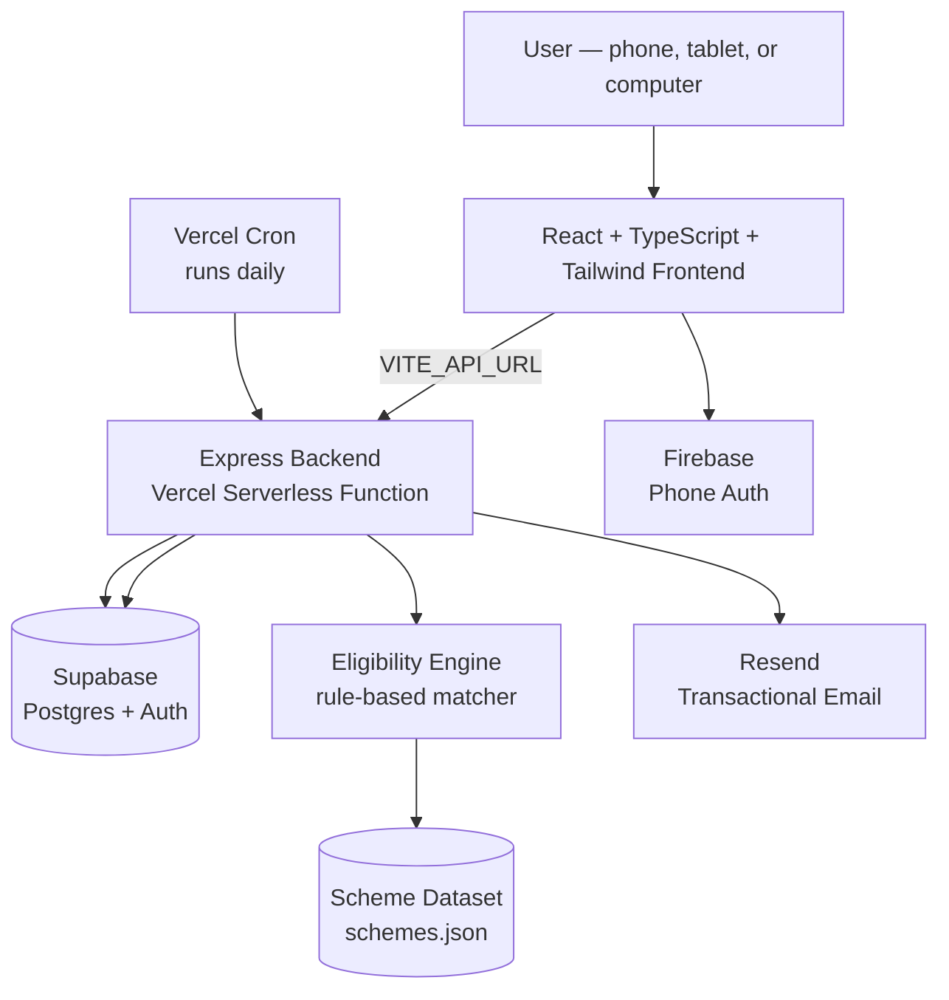

<div align="center">


<h1>Haq Agent</h1>
<p><i>हर योजना, हर हकदार तक — Every scheme, to every rightful person</i></p>


<p>
  
  
  
  
  
  
  
  
</p>

<br/>


<p><i>Built for Bharat — designed to reach people, not just devices</i></p>

<br/>

**[🔴 Live Demo](https://haq-agent-gamma.vercel.app)** · **[📄 Pitch Deck](#)** · **[🐛 Report an Issue](../../issues)**

</div>

---

## 📖 Table of Contents

- [The Problem](#-the-problem)
- [The Solution](#-the-solution)
- [Key Features](#-key-features)
- [How It Was Built](#-how-it-was-built)
- [Architecture](#-architecture)
- [Tech Stack & Why](#-tech-stack--why)
- [Getting Started Locally](#-getting-started-locally)
- [Environment Variables](#-environment-variables)
- [Deployment](#-deployment)
- [Roadmap](#-roadmap)
- [Author](#-author)

---

## 💡 The Problem

It's not that government schemes don't exist. It's that they never reach the people who need them most.

- 🎓 **NITI Aayog** opens fresh internship applications in the first ten days of every single month — a real, recurring opportunity that almost nobody in rural classrooms has heard of.
- 🏠 Quotas and subsidies meant for low-income, rural households often get claimed by people who simply *know where to look* — while the family next door, who genuinely needs it, never even hears the scheme exists.
- 📋 Over **1,000+ schemes** for farmers, students, patients, and workers sit scattered across disconnected government portals, with no single place that tells a person clearly what they qualify for.

**Awareness, not eligibility, is what's broken.**

## ✨ The Solution

**Haq Agent** is an AI agent that finds the government schemes people already qualify for — and helps them actually get the benefit. You describe your situation once, in Hindi or English, by chat or by voice. The agent keeps checking, keeps you informed, and keeps acting — even when you're not asking.

<div align="center">

| 🗣️ Speak | ✅ Check | 📝 Apply | 🔔 Notify | 📊 Follow up |
|:---:|:---:|:---:|:---:|:---:|
| Bilingual, voice-first conversation | Real eligibility engine, not a guess | Apply directly the moment you qualify | Daily automatic check + email alert | Live status + document checklist |

</div>

## 🔑 Key Features

- **Bilingual, voice-first chat** — speaks the user's language literally, so literacy or smartphone comfort is never a barrier. Powered by the Web Speech API for voice input in both Hindi and English.
- **Explainable eligibility matching** — every matched scheme comes with a plain-language reason (e.g. *"Automatically eligible — age 72 meets the 70+ universal coverage rule"*), never a black box.
- **Document checklist before you travel** — tells you exactly which documents you're missing before you waste a trip to a government office.
- **Real accounts, two ways in** — email (with OTP or password) via Supabase Auth, and mobile number OTP via Firebase Phone Auth, so no one is blocked by not having the "right" kind of account.
- **Smart Apply, not just a link-out** — if you've already told the agent about yourself and you qualify, "Apply Now" works instantly, right from the Schemes page — no detour through the chat required. If you haven't yet, or don't qualify, the app is honest about it instead of pretending.
- **A real background job, not a demo trick** — a Vercel Cron function runs daily, re-checks every saved profile against the scheme dataset, and emails users automatically the moment something new opens up for them. This keeps running in production, not just during a live demo.
- **Application tracking with real data** — every "Apply" creates a real row in Postgres, with a live document checklist and status, plus a direct link to the actual official government portal to finish the process.

## 🏗️ How It Was Built

This project went from idea submission to a fully deployed, end-to-end working product — real database, real auth, real background jobs — built and debugged iteratively, one working piece at a time rather than all at once.

**The eligibility engine** is a plain rule-based matcher (`eligibility.js`) that runs a user's profile against a JSON dataset of real government schemes (PM-KISAN, Ayushman Bharat/PMJAY, AICTE Pragati Scholarship, IGNOAPS pension, and more), checking things like occupation, land ownership, income ceilings, BPL/SECC status, and age-based universal-coverage rules — deliberately kept transparent and debuggable rather than a black-box model, since every match needs a defensible, explainable reason.

**Authentication** turned out to need two separate systems working side by side: **Supabase Auth** handles email login (password-based, and a 6-digit one-time code sent via a custom SMTP relay through **Resend**), while **Firebase Phone Auth** handles mobile OTP login with a registered test number for demo purposes. Both converge on the same `localStorage`-based session so the rest of the app doesn't need to care which path a user came in through.

**The backend** is an Express API, restructured to run as a single **Vercel serverless function** (`api/index.js` wrapping the Express app) so the whole thing deploys on Vercel's free tier without needing a separate always-on server. Routes cover authentication, eligibility checks, application creation and tracking, and the scheme-watch/notification system.

**Notifications** are the feature I'm proudest of: when a user finishes the eligibility chat, their profile is saved to a `user_scheme_watches` table in Postgres. A **Vercel Cron Job**, configured directly in `vercel.json`, hits a protected endpoint once a day, re-runs the eligibility check for every saved profile, diffs it against what they were already told about, and emails them — via Resend — about anything genuinely new. This is a real, running, scheduled job in production, not a button that fakes it for a demo.

**Deployment** is split into two separate Vercel projects from the same monorepo — one with its Root Directory set to `backend`, one to `frontend` — connected by environment variables (`VITE_API_URL` on the frontend pointing at the backend, `FRONTEND_URL` on the backend for CORS). Along the way this surfaced a handful of very "real-world deployment" bugs worth naming honestly: a missing `vercel.json` SPA rewrite rule that caused every direct route to 404 in production, a CORS allowlist that only trusted `localhost` and broke the moment testing moved to `127.0.0.1`, and a Resend sandbox restriction that silently blocks confirmation emails to any address other than the account owner's — each diagnosed from actual runtime logs rather than guesswork, and fixed at the root cause rather than patched around.

## 🏛️ Architecture



## 🛠️ Tech Stack & Why

| Layer | Choice | Why |
|---|---|---|
| Frontend | **React + TypeScript + Vite** | Fast dev loop, type safety across a growing codebase with many interconnected pages |
| Styling | **Tailwind CSS** | Rapid, consistent UI without a separate design system to maintain solo |
| Backend | **Node.js + Express** | Simple, well-understood, easy to reason about for a solo-built API |
| Hosting | **Vercel (Serverless Functions + Cron)** | Free tier covers both static hosting and a real scheduled job — no separate infra to manage |
| Database & Auth | **Supabase (Postgres + Auth)** | Managed Postgres with row-level auth built in, generous free tier |
| Phone Auth | **Firebase Phone Auth** | Handles OTP delivery and verification without building SMS infrastructure from scratch |
| Email | **Resend** | Simple transactional email API, used both for Supabase's custom SMTP and for scheme-match notifications |
| Voice Input | **Web Speech API** | Native browser API, no extra service needed for bilingual voice input |

## 🚀 Getting Started Locally

```bash
# Clone the repo
git clone https://github.com/Snehachoudhary26/HAQ-agent.git
cd HAQ-agent

# --- Backend ---
cd backend
cp .env.example .env   # fill in your own Supabase + Resend keys — see below
npm install
npm run dev              # → http://localhost:4000

# --- Frontend (in a new terminal) ---
cd frontend
cp .env.example .env.local
npm install
npm run dev               # → http://localhost:5173
```

## 🔐 Environment Variables

**Never commit real values for any of these.** Both `.env` and `.env.local` are already git-ignored. Copy the `.env.example` files and fill in your own keys locally, or set them directly in your hosting provider's dashboard (that's what production uses).

**`backend/.env`**
```
SUPABASE_URL=
SUPABASE_SECRET_KEY=
RESEND_API_KEY=
CRON_SECRET=
FRONTEND_URL=
PORT=4000
```

**`frontend/.env.local`**
```
VITE_API_URL=
```

## ☁️ Deployment

Deployed as two separate Vercel projects from this one repository:

1. **Backend** — Vercel project with Root Directory set to `backend`. Environment variables set in the Vercel dashboard. `backend/vercel.json` defines both the serverless function routing and the daily cron schedule.
2. **Frontend** — Vercel project with Root Directory set to `frontend`. `VITE_API_URL` points at the deployed backend URL. `frontend/vercel.json` includes the SPA rewrite rule so client-side routes work on direct visit/refresh.

## 🗺️ Roadmap

- [x] **Phase 1** — Education, Agriculture, Pension, Health categories · bilingual chat · real email notifications · application tracking
- [ ] **Phase 2** — Expand scheme coverage across more states · explore official scheme API integrations (myscheme.gov.in)
- [ ] **Phase 3** — Partner with Panchayats & Lok Seva Kendras for offline support · add regional languages beyond Hindi and English · build a transparency view of which schemes reach whom

## 👩‍💻 Author

**Sneha Choudhary**
B.Tech Final Year — CSE (Data Science), School of Information Technology, RGPV Bhopal
Built solo for **ScriptedBy{Her} 2.0** — Meesho x HackerEarth

<div align="center">

*Government schemes shouldn't stay hidden.*

</div>
